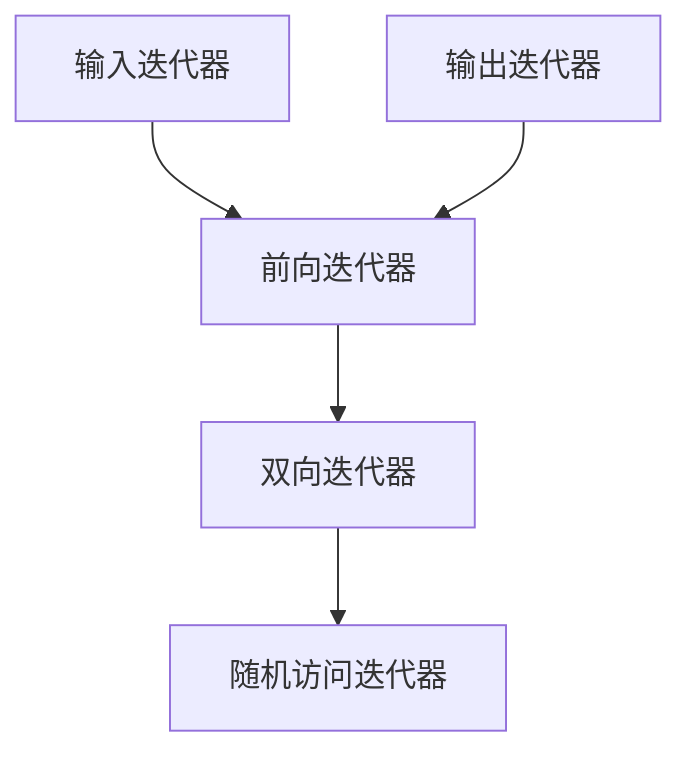

我的C++标准模板库（Standard Template Library，STL）学习笔记。

<!-- more -->

## STL Hello World

STL包括以下4种基本组件：

1. **容器（Container）**：容器是容纳、包含一组元素的对象。容器类库中包括7种基本容器：向量（vector）、双端队列（deque）、列表（list）、集合（set）、多重集合（multiset）、映射（map）、多重映射（multimap）；

    - 按照容器中元素的组织方式，可以将容器分为两种基本类型：顺序容器（sequence container）和关联容器（associative container）：
        - **顺序容器**：将一组具有相同类型的元素以严格线性形式组织起来，向量、双端队列和列表容器就属于这一种；
        - **关联容器**：具有根据一组索引来快速提取元素的能力，集合和映射容器就属于这一种；
    - 按照容器关联的迭代器类型，容器具有可逆容器（reversible container）这一子概念，可逆容器又具有随机访问容器（random access container）这一子概念，STL提供的标准容器都至少是可逆容器；
    - 使用不同的容器，需要包含不同的头文件，STL中基本容器对应的头文件和分类如下表所示：

        | 容器名 | 中文名 | 头文件 | 分类 |
        | :---- | :---- | :---- | :---- |
        | `vector` | 向量 | `#include <vector>` | 随机访问容器，顺序容器 |
        | `deque` | 双端队列 | `#include <deque>` | 随机访问容器，顺序容器 |
        | `list` | 列表 | `#include <list>` | 可逆容器，顺序容器 |
        | `array` | 数组 | `#include <array>` | 随机访问容器，顺序容器，C++11引入 |
        | `set` | 集合 | `#include <set>` | 可逆容器，关联容器 |
        | `multiset` | 多重集合 | `#include <set>` | 可逆容器，关联容器 |
        | `map` | 映射 | `#include <map>` | 可逆容器，关联容器 |
        | `multimap` | 多重映射 | `#include <map>` | 可逆容器，关联容器 |

2. **迭代器（Iterator）**：迭代器用于遍历对象集合的元素，这些集合可能是容器，也可能是容器的子集；

    - 迭代器是泛化的指针；
    - 使用独立于STL容器的迭代器，需要包含头文件`#include <iterator>`；

3. **函数对象（Function Object）**：函数对象是一个行为类似函数的对象，对它可以像调用函数一样调用；

    - 函数对象是泛化的函数；
    - 使用STL的函数对象，需要包含头文件`#include <functional>`；

4. **算法（Algorithm）**：算法作用于容器，它们提供了执行各种操作的方式，包括对容器内容执行初始化、排序、搜索和转换等操作；

    - 使用STL的算法，需要包含头文件`#include <algorithm>`；

## 容器

符号说明：

- `S`：容器类型；
- `s`：`S`类型的实例；
- `T`：元素类型；
- `t`：`T`类型的实例；
- `K`：键的类型；
- `k`：`K`类型的实例；
- `n`：整型数据；
- `p`：指向`s`中元素的迭代器；
- `q`：任何指向`T`类型元素的输入迭代器（未必指向`S`中的元素，也未必具有`S::iterator`类型）；

### 容器基本功能

```cpp
// 调用默认构造函数初始化
S s1, s2;
// op为比较运算符，对两个容器之间的元素按字典顺序进行比较
s1 op s2
// 返回迭代器
S::iterator s1.begin()              // 前向迭代器，指向容器第一个元素
S::iterator s1.end()                // 前向迭代器，指向容器最后一个元素的下一个位置
S::reverse_iterator s1.rbegin()     // 逆向迭代器，指向容器最后一个元素
S::reverse_iterator s1.rend()       // 逆向迭代器，指向容器第一个元素的前一个位置
// 成员函数
void s1.clear()
bool s1.empty()
size_t s1.size()
void s1.swap(s2)
```

1. 不推荐使用`size()`成员函数判断容器是否为空，因为在某些容器中需要通过遍历整个容器获得元素个数，效率较低，相比之下使用`empty()`成员函数判断容器是否为空效率更高；
2. 不推荐在循环控制条件中使用`i < s1.size() - 1`进行循环条件判断，因为`size()`成员函数返回的是无符号整型，当容器为空时，`s1.size() - 1`会导致范围溢出，获得一个很大的数，相比之下使用`i + 1 < s1.size()`进行循环条件判断更加合理；
3. 不推荐使用临时变量手动交换容器内容，因为这会带来大量元素复制、动态内存分配和释放，效率较低，相比之下使用`swap()`成员函数交换容器内容效率更高，`swap()`成员函数通过交换数据成员实现，效率更高；
4. 使用`swap()`成员函数与一个空容器交换内容可以在清空容器的同时释放内存；

### 顺序容器

包括`vector`、`deque`、`list`，常用基本功能如下所示：

```cpp
// 构造函数
S s(n, t)                   // 构造一个由n个t元素构成的容器实例s
S s(n)                      // 构造一个有n个元素的容器实例s，每个元素都是T()
S s(q1, q2)                 // 使用将迭代器[q1, q2)区间内的数据作为s的元素构造s
// 赋值函数
void s.assign(n, t)         // 赋值后的容器由n个t元素构成
void s.assign(n)            // 赋值后的容器有n个t元素的容器实例s，每个元素都是T()
void s.assign(q1, q2)       // 赋值后的容器的元素为[q1, q2)区间内的数据
// 改变容器的大小
void s.resize(n, t)         // 超出新容器大小的元素被舍弃，超出原容器大小的部分由t元素构成
void s.resize(n)            // 超出新容器大小的元素被舍弃，超出原容器大小的部分由T()构成
// 首尾元素的直接访问
value_type& s.front()
value_type& s.back()
// 在容器尾部插入、删除元素
void s.push_back(t)
void s.pop_back()
// 在容器头部插入、删除元素（deque、list）
void s.push_front(t)
void s.pop_front()
// 在容器头部插入、删除元素（vector）
void s.insert(s.begin(), t)
void s.erase(s.begin())
```

三种顺序容器的特性不同，需要根据实际应用场景进行选择，各容器适合的场景如下表所示：

| 容器 | 随机访问 | 扩展方式 |
| :---- | :---- | :---- |
| `vector` | 需要大量 | 只需要向容器尾部加入新的元素 |
| `deque` | 需要少量 | 需要在容器两端插入或删除元素 |
| `list` | 不需要 | 需要在中间位置插入或删除元素 |

详细比较可参考《C++语言程序设计》P422表10-2。

#### 向量`vector`

1. 访问元素方式的区别：

    ```cpp
    s[i]                    // 无越界检查，需要确保下标不超过容器容量
    s.at(i)                 // 有越界检查，下标越界时会抛出std::out_of_range异常
    ```

2. `push_back()`和`emplace_back()`的区别：

    ```cpp
    void s.push_back(t)     // 在容器尾部插入一个元素，创建+拷贝或移动（拷贝优先）
    void s.emplace_back(t)  // 在容器尾部创建一个元素，直接在容器中创建，C++11引入，执行效率高
                            // 也支持将元素的初始化列表作为参数传入
    ```

    类似的还有`insert()`和`emplace()`：

    ```cpp
    void s.insert(p, t)     // 在容器中p指向的位置插入一个元素，创建+拷贝或移动（拷贝优先）
    void s.emplace(p, t)    // 在容器中p指向的位置创建一个元素，直接在容器中创建，C++11引入，执行效率高
                            // 也支持将元素的初始化列表作为参数传入
    ```

3. `size()`和`capacity()`的区别：

    ```cpp
    size_t s.size()         // 返回向量容器的大小
    void s.resize(n)        // 改变向量容器的大小
    size_t s.capacity()     // 返回向量容器的容量
    void s.reserve(n)       // 改变向量容器的容量
    ```

4. 释放内存方式的区别：

    ```cpp
    // 与空容器交换内容，在清空容器的同时释放内存
    std::vector<T>().swap(s);
    // 先清空容器，再释放内存
    s.clear();
    s.shrink_to_fit();      // 将容器的容量缩减到与容器的大小相同，C++11引入
    ```

#### `vector<bool>`

如果需要保存多个布尔值，建议使用`deque<bool>`或`bitset`，不推荐使用`vector<bool>`，在模板类和模板函数中，需要注意类型参数类型`T`为`bool`时的情况。

`vector<bool>`是对于`vector`模板类的特化（specialize），为了节省存储空间，每个元素按照位（bit）保存，而不是按照字节（byte）保存，会带来以下影响：

1. 元素在内存中不是连续存储的；
2. 下标运算符`[]`返回的是`std::vector<bool>::reference`类模拟的`bool`类型的引用；

    - 原型声明：

        ```cpp
        class vector<bool>::reference {
          friend class vector;
          reference() noexcept;  // no public constructor
         public:
          ~reference();
          operator bool() const noexcept;                     // convert to bool
          reference& operator=(const bool x) noexcept;        // assign from bool
          reference& operator=(const reference& x) noexcept;  // assign from bit
          void flip();                                        // flip bit value.
        };
        ```

    - 注意`auto`关键字引起的悬垂指针问题：

        ```cpp
        std::vector<bool> a{true, false};
        bool b = a[0];  // 隐式类型转换，容器销毁后，b的值依然可用
        auto c = a[0];  // reference类，容器销毁后，c变成悬垂指针，引发未定义行为
        ```

3. 不使用`std:：allocater_traits:：construct`来构造位值；
4. 同一容器中的不同元素不能被不同的线程并发修改；

### 顺序容器的适配器

以顺序容器为基础构建一些常用数据结构，STL提供的容器适配器栈`stack`和队列`queue`，就是对顺序容器的封装。

1. 栈：**先进后出（FILO）**，即最先被压入栈的元素总是最后被弹出；
2. 队列：**先进先出（FIFO）**，即最先入队的元素总是最先出队；

#### 顺序容器适配器的基本功能

```cpp
// op为比较运算符，对两个容器之间的元素按字典顺序进行比较
s1 op s2
// 成员函数
size_t s.size()
bool s.empty()
void s.push()
void s.pop()
```

容器适配器不支持迭代器，因为它们不允许对任意元素进行访问。

#### 栈`stack`

使用时需要包含头文件：

```cpp
#include <stack>
```

对于栈来说，只有栈顶的元素是可以访问到的：

```cpp
value_type& s.top()
```

#### 队列`queue`

使用时需要包含头文件：

```cpp
#include <queue>
```

对于队列来说，只有队头和队尾的元素是可以访问到的：

```cpp
value_type& s.front()
value_type& s.back()
```

### 关联容器

关联容器中元素的顺序按照键的取值升序排列。

| 类型 | 简单关联容器 | 二元关联容器 |
| :---- | :---- | :---- |
| 单重关联容器 | 集合`set` | 映射`map` |
| 多重关联容器 | 多重集合`multiset` | 多重映射`multimap` |

1. 单重关联容器：键是唯一的，不允许重复；
2. 多重关联容器：相同的键允许重复出现；
3. 简单关联容器：以元素本身作为键，只有一个类型参数，该类型既是键类型，又是容器类型；
4. 二元关联容器：元素是由键和某种类型的附加数据共同构成的，键只是元素的一部分，有两个类型参数，前一个是键类型，后一个是附加数据的类型；

常用基本功能如下：

```cpp
// 构造函数
S s(q1, q2);
// 元素的插入
// 单重关联容器：只有当不存在相同键的元素时才能成功插入
pair<S::iterator, bool> s.insert(t);                // 创建+拷贝或移动（拷贝优先）
pair<S::iterator, bool> s.emplace(t);               // 直接在容器中创建，C++11引入，执行效率高
                                                    // 对于二元关联容器，也支持将键和值作为参数传入
// 多重关联容器：插入总会成功
S::iterator s.insert(t);                            // 创建+拷贝或移动（拷贝优先）
S::iterator s.emplace(t);                           // 直接在容器中创建，C++11引入，执行效率高
                                                    // 对于二元关联容器，也支持将键和值作为参数传入
// 元素的删除
size_t s.erase(k);                                  // 删除所有键为k的元素，返回被删除元素的个数
// 基于键的查找和计数
S::iterator s.find(k);                              // 找到任意一个键为k的元素，返回该元素的迭代器，如果s中没有键为k的元素，则返回s.end()
S::iterator s.lower_bound(k);                       // 得到s中第一个键值不小于k的元素的迭代器
S::iterator s.upper_bound(k);                       // 得到s中第一个键值大于k的元素的迭代器
pair<S::iterator, S::iterator> s.equal_range(k);    // 得到包含所有键为k的元素的区间[p1, p2)，满足p1 == s.lower_bound(k)且p2 == s.upper_bound(k)
size_t s.count(k);                                  // 得到s容器中键为k的元素个数
```

1. 关联容器的最大优势在于，可以高效地根据键来查找容器中的一个元素；
2. 关联容器的键之间必须能够使用`<`比较大小，对于自定义数据类型需要重载`<`运算符，C++规定`<`运算符必须构成严格弱序关系（strict weak ordering），必须满足以下四条性质：

    - 非自反性（irreflexivity）：`(a < a) == false`；
    - `<`传递性（transitivity）：如果`(a < b) == true`且`(b < c) == true`，则`(a < c) == true`；
    - 非对称性（asymmetry）：如果`(a < b) == true`，则`(b < a) == false`；
    - `==`传递性：把`a == b`定义为`!(a < b) && !(b < a)`，如果`(a == b) == true`且`(b == c) == true`，则`(a == c) == true`；

3. 关联容器的插入和删除操作不会使任何已有的迭代器、指针或引用失效；
4. 不建议使用浮点数作为键的类型，建议将其转换为整数或字符串作为键的类型；
5. 如果必须使用浮点数作为键的类型，可以使用`upper_bound()`函数或`lower_bound()`函数查询区间，常用于位姿插值；

#### 集合`set`

使用时需要包含头文件：

```cpp
#include <set>
```

原型声明：

```cpp
template <class T,                      // 指定元素的类型
          class Compare = less<T>,      // 指定排序规则
          class Alloc = allocator<T>    // 指定分配器对象的类型
          >
class set;
```

#### 映射`map`

使用时需要包含头文件：

```cpp
#include <map>
```

原型声明：

```cpp
template <class Key,                                    // 指定键（key）的类型
          class T,                                      // 指定值（value）的类型
          class Compare = less<Key>,                    // 指定排序规则
          class Alloc = allocator<pair<const Key, T>>   // 指定分配器对象的类型
          >
class map;
```

映射`map`重载了下标运算符`[]`，可以用于插入和查找元素：

```cpp
s[k]    // 如果键k存在，则返回对应的值，如果键k不存在，则插入键k，对应的值取默认值并返回
s.at(k) // 如果键k存在，则返回对应的值，如果键k不存在，则抛出std::out_of_range异常
```

### 无序关联容器

无序关联容器，又称哈希容器，C++11引入。

| 类型 | 简单无序关联容器 | 二元无序关联容器 |
| :---- | :---- | :---- |
| 单重无序关联容器 | 无序集合`unordered_set` | 无序映射`unordered_map` |
| 多重无序关联容器 | 无序多重集合`unordered_multiset` | 无序多重映射`unordered_multimap` |

1. 关联容器的底层实现使用红黑树的存储结构，适用于使用迭代器遍历容器中存储的元素；
2. 无序关联容器的底层实现使用哈希表的存储结构，适用于通过指定键查找对应的值（平均时间复杂度为O(1)）；

#### 无序集合`unordered_set`

使用时需要包含头文件：

```cpp
#include <unordered_set>
```

原型声明：

```cpp
template <class Key,                    // 指定元素的类型
          class Hash = hash<Key>,       // 确定元素存储位置所用的哈希函数
          class Pred = equal_to<Key>,   // 判断各个元素是否相等所用的函数
          class Alloc = allocator<Key>  // 指定分配器对象的类型
          >
class unordered_set;
```

默认哈希函数`hash<Key>`只支持基本数据类型，默认比较函数`equal_to<Key>`只支持可直接用`==`运算符比较的数据类型，对于自定义数据类型需要重新实现，以三维向量为例：

```cpp
// hash of vector
template <int N>
struct hash_vec {
    inline size_t operator()(const Eigen::Matrix<int, N, 1>& v) const;
};

// equal of vector
template <int N>
struct equal_to {
    inline bool operator()(const Eigen::Matrix<int, N, 1>& v1, const Eigen::Matrix<int, N, 1>& v2) const;
};

// vec 3 hash
/// @see Optimized Spatial Hashing for Collision Detection of Deformable Objects, Matthias Teschner et. al., VMV 2003
template <>
inline size_t hash_vec<3>::operator()(const Eigen::Matrix<int, 3, 1>& v) const {
    return size_t(((v[0]) * 73856093) ^ ((v[1]) * 471943) ^ ((v[2]) * 83492791)) % 10000000;
}

// vec 3 equal
template <>
inline bool equal_to<3>::operator()(const Eigen::Matrix<int, 3, 1>& v1, const Eigen::Matrix<int, 3, 1>& v2) const {
    return ((v1[0] == v2[0]) && (v1[1] == v2[1]) && (v1[2] == v2[2]));
}
```

#### 无序映射`unordered_map`

使用时需要包含头文件：

```cpp
#include <unordered_map>
```

原型声明：

```cpp
template <class Key,                                   // 指定键（key）的类型
          class T,                                     // 指定值（value）的类型
          class Hash = hash<Key>,                      // 确定键值对存储位置所用的哈希函数
          class Pred = equal_to<Key>,                  // 判断各个键值对的键是否相等所用的函数
          class Alloc = allocator<pair<const Key, T>>  // 指定分配器对象的类型
          >
class unordered_map;
```

无序映射`unordered_map`重载了下标运算符`[]`，可以用于插入和查找元素：

```cpp
s[k]    // 如果键k存在，则返回对应的值，如果键k不存在，则插入键k，对应的值取默认值并返回
s.at(k) // 如果键k存在，则返回对应的值，如果键k不存在，则抛出std::out_of_range异常
```

## 迭代器

按照功能，迭代器可以分为五类：

1. 输入迭代器（Input Iterator）：从序列中读取数据；
2. 输出迭代器（Output Iterator）：向序列中写入数据；
3. 前向迭代器（Forward Iterator）：既支持数据读取，也支持数据写入；
4. 双向迭代器（Bidirectional Iterator）：在单向迭代器的基础上，又支持迭代器向反向移动；
5. 随机访问迭代器（Random Access Iterator）：在双向迭代器的基础上，又支持直接将迭代器向前或向后移动n个元素；

迭代器之间的继承关系如下图所示：



使用时需要包含头文件：

```cpp
#include <iterator>
```

### 迭代器辅助函数

```cpp
void advance(p, n);                     // 迭代器前进或后退
size_t distance(s.begin(), s.end());    // 计算两个迭代器之间的距离
```

#### 前进后退函数`advance()`

原型声明：

```cpp
template <class InputIterator, class Distance>
void advance(InputIterator& it, Distance n);
```

1. 迭代器类型和距离：

    - 对于双向迭代器和随机访问迭代器，由于迭代器支持反向移动，n可以取负值，表示后退；
    - 对于其他类型迭代器，由于迭代器只支持正向移动，n只能取正值，表示前进；

2. 迭代器类型和底层实现：

    - 对于随机访问迭代器，底层通过`p + n`和`p - n`实现；
    - 对于其他类型迭代器，底层通过`++`和`--`实现；

#### 计算距离函数`distance()`

原型声明：

```cpp
template <class InputIterator>
typename iterator_traits<InputIterator>::difference_type distance(InputIterator first, InputIterator last);
```

1. 要求左闭右开区间`[first, last)`有效，返回区间内元素的个数；
2. 对于随机访问迭代器，底层通过`last - first`计算距离，时间复杂度为O(1)；
3. 对于非随机访问迭代器，底层通过`++first`或`first++`，直到`first == last`计算距离，时间复杂度为O(n)；

## 算法

### 算法分类

一般来说，STL的算法可以分为4大类：

1. **不可变序列算法**：不直接修改所操作的容器内容的算法；
2. **可变序列算法**：可以修改所操作的容器内容的算法；
3. **排序和搜索算法**：对序列元素进行比较操作的算法；
4. **数值算法**：4个通用数值算法；

使用时需要包含头文件：

```cpp
#include <algorithm>                            // 大部分算法
#include <numeric>                              // 数值算法
```

### 不可变序列算法

#### 遍历函数`for_each()`

```cpp
void for_each(s.begin(), s.end(), fn);                              // 对区间内的每一个元素进行某操作，fn常结合C++11引入的Lambda表达式使用
void for_each(std::execution::par_unseq, s.begin(), s.end(), fn);   // 使用并发，C++17引入，需要#include <execution>
```

原型声明：

```cpp
template <class InputIterator, class Function>
Function for_each(InputIterator first, InputIterator last, Function fn);
```

实现：

```cpp
template <class InputIterator, class Function>
Function for_each(InputIterator first, InputIterator last, Function fn) {
    while (first != last) {
        fn(*first);
        ++first;
    }
    return fn;  // or, since C++11: return move(fn);
}
```

### 可变序列算法

```cpp
void reverse(s.begin(), s.end());               // 反转区间元素次序
void swap(t1, t2);                              // 交换（对调）实例
void swap(s1, s2);                              // 交换（对调）容器
```

#### 反转函数`reverse()`

原型声明：

```cpp
template <class BidirectionalIterator>
void reverse(BidirectionalIterator first, BidirectionalIterator last);
```

实现：

```cpp
template <class BidirectionalIterator>
void reverse(BidirectionalIterator first, BidirectionalIterator last) {
  while ((first != last) && (first != --last)) {
    std::iter_swap(first, last);
    ++first;
  }
}
```

#### 交换函数`swap()`

原型声明：

```cpp
template <class T>
void swap(T& a, T& b) noexcept(is_nothrow_move_constructible<T>::value&& is_nothrow_move_assignable<T>::value);
template <class T, size_t N>
void swap(T (&a)[N], T (&b)[N]) noexcept(noexcept(swap(*a, *b)));
```

实现：

```cpp
template <class T>
void swap(T& a, T& b) {
  T c(std::move(a));
  a = std::move(b);
  b = std::move(c);
}
template <class T, size_t N>
void swap(T (&a)[N], T (&b)[N]) {
  for (size_t i = 0; i < N; ++i) swap(a[i], b[i]);
}
```

1. 通过模板函数重载，使得交换实例和交换容器具有相同形式，兼顾了效率和一致性；
2. C++11以后，所在头文件发生了变化，需要包含头文件`#include <utility>`；

### 排序和搜索算法

```cpp
void sort(s.begin(), s.end());                      // 对区间元素进行排序，默认以元素值的大小做升序排序
S::iterator nth_element(s.begin(), nth, s.end());   // 重新安排序列中的第n个元素的左右两侧的元素，使得左侧元素小于第n个元素，右侧元素大于第n个元素
S::iterator upper_bound(s.begin(), s.end());        // 在有序区间内按照二分查找方法查找与某一特定值相等的元素，并返回最后一个可插入的位置迭代器（大于）
S::iterator lower_bound(s.begin(), s.end());        // 在有序区间内按照二分查找方法查找与某一特定值相等的元素，并返回第一个可插入的位置迭代器（大于等于）
bool binary_search(s.begin(), s.end(), t);          // 在有序区间内按照二分查找方法查找是否存在与某一特定值相等的元素
pair<S::iterator, S::iterator> equal_range(s.begin(), s.end(), t);  // 在有序区间内按照二分查找方法查找是否存在与某一特定值相等的元素，并返回一个上下限区间
value_type& min(t1, t2);                            // 返回最小值元素
value_type& max(t1, t2);                            // 返回最大值元素
S::iterator min_element(s.begin(), s.end());        // 返回最小值元素所在位置
S::iterator max_element(s.begin(), s.end());        // 返回最大值元素所在位置
```

需要注意容器为空的情况，此时返回的迭代器为`s.end()`。

#### 排序函数`sort()`

```cpp
void sort(s.begin(), s.end());                  // 对区间元素进行排序，默认以元素值的大小做升序排序
void sort(s.begin(), s.end(), comp);            // 对区间元素进行排序，指定比较函数
```

原型声明：

```cpp
template <class RandomAccessIterator>
void sort(RandomAccessIterator first, RandomAccessIterator last);
template <class RandomAccessIterator, class Compare>
void sort(RandomAccessIterator first, RandomAccessIterator last, Compare comp);
```

1. `sort()`函数基于内省排序实现，是快速排序和堆排序的结合，旧版C++标准要求平均时间复杂度为O(nlogn)，C++11标准要求最坏时间复杂度为O(nlogn)，；
2. `sort()`函数出于效率上的考虑，要求迭代器类型必须为随机访问迭代器`RandomAccessIterator`，因此只支持`vector`、`deque`、`array`这三个容器；
3. `sort()`函数默认以元素值的大小做升序排序，要求元素类型必须支持`<`运算符，如果使用STL提供的其他排序规则，元素类型也必须支持该规则底层实现所使用的比较运算符；
4. `sort()`函数在实现排序时，需要交换容器中元素的存储位置，如果容器中存储的元素是自定义的类对象，则类的内部必须提供移动构造函数和移动赋值运算符；
5. `sort()`函数对于左闭右开区间`[first, last)`进行排序，当容器为空或者容器中只有一个元素时，`sort()`函数会在判断后自动返回，不需要用户检查容器大小；
6. `sort()`函数在对于自定义数据类型进行排序时需要定义比较函数`comp`，实现`<`运算符对应的逻辑：

    - 比较函数`comp`必须构成严格弱序关系，否则会引起程序崩溃；
        - 不建议在比较函数`comp`内部实现复杂的排序规则，因为可能不满足严格弱序关系；
        - 建议在比较函数`comp`外部计算排序规则对应的指标，将索引和指标分别保存为二元组的键和值，在比较函数`comp`内部对于二元组的值进行排序；
    - 比较函数`comp`通常定义为类中的静态函数成员或lambda表达式；
    - 以对于二元组`std::pair<int, Eigen::Vector2f>`的值进行排序为例：

        ```cpp
        static bool comp(const std::pair<int, Eigen::Vector2f>& a, const std::pair<int, Eigen::Vector2f>& b) {
          return a.second.x() < b.second.x();
        }
        ```

### 数值算法

```cpp
value_type& accumulate(s.begin(), s.end(), init);               // 计算序列中所有元素的和
S::iterator partial_sum(s.begin(), s.end(), result);            // 累加序列中部分元素的值，并将结果保存在另一个序列中
S::iterator adjacent_difference(s.begin(), s.end(), result);    // 计算序列中相邻元素的差，并将结果保存在另一个序列中
value_type& inner_product(s.begin(), s.end(), init);            // 累加两个序列对应元素的乘积，也就是序列的内积
```

#### 求和函数`accumulate()`

原型声明：

```cpp
template <class InputIterator, class T>
T accumulate(InputIterator first, InputIterator last, T init);
template <class InputIterator, class T, class BinaryOperation>
T accumulate(InputIterator first, InputIterator last, T init,
             BinaryOperation binary_op);
```

实现：

```cpp
template <class InputIterator, class T>
T accumulate(InputIterator first, InputIterator last, T init) {
    while (first != last) {
        init = init + *first;  // or: init=binary_op(init,*first) for the binary_op version
        ++first;
    }
    return init;
}
```

#### 部分和函数`partial_sum()`

原型声明：

```cpp
template <class InputIterator, class OutputIterator>
OutputIterator partial_sum(InputIterator first, InputIterator last,
                           OutputIterator result);
template <class InputIterator, class OutputIterator, class BinaryOperation>
OutputIterator partial_sum(InputIterator first, InputIterator last,
                           OutputIterator result, BinaryOperation binary_op);
```

实现：

```cpp
template <class InputIterator, class OutputIterator>
OutputIterator partial_sum(InputIterator first, InputIterator last,
                           OutputIterator result) {
    if (first != last) {
        typename iterator_traits<InputIterator>::value_type val = *first;
        *result = val;
        while (++first != last) {
            val = val + *first; // or: val = binary_op(val,*first)
            *++result = val;
        }
        ++result;
    }
    return result;
}
```

#### 相邻差函数`adjacent_difference()`

原型声明：

```cpp
template <class InputIterator, class OutputIterator>
OutputIterator adjacent_difference(InputIterator first, InputIterator last,
                                   OutputIterator result);
template <class InputIterator, class OutputIterator, class BinaryOperation>
OutputIterator adjacent_difference(InputIterator first, InputIterator last,
                                   OutputIterator result,
                                   BinaryOperation binary_op);
```

实现：

```cpp
template <class InputIterator, class OutputIterator>
OutputIterator adjacent_difference(InputIterator first, InputIterator last,
                                   OutputIterator result) {
    if (first != last) {
        typename iterator_traits<InputIterator>::value_type val, prev;
        *result = prev = *first;
        while (++first != last) {
            val = *first;
            *++result = val - prev; // or: *++result = binary_op(val,prev)
            prev = val;
        }
        ++result;
    }
    return result;
}
```

#### 内积函数`inner_product()`

原型声明：

```cpp
template <class InputIterator1, class InputIterator2, class T>
T inner_product(InputIterator1 first1, InputIterator1 last1,
                InputIterator2 first2, T init);
template <class InputIterator1, class InputIterator2, class T,
          class BinaryOperation1, class BinaryOperation2>
T inner_product(InputIterator1 first1, InputIterator1 last1,
                InputIterator2 first2, T init, BinaryOperation1 binary_op1,
                BinaryOperation2 binary_op2);
```

实现：

```cpp
template <class InputIterator1, class InputIterator2, class T>
T inner_product(InputIterator1 first1, InputIterator1 last1,
                InputIterator2 first2, T init) {
    while (first1 != last1) {
        init = init + (*first1) * (*first2);
        // or: init = binary_op1 (init, binary_op2(*first1,*first2));
        ++first1;
        ++first2;
    }
    return init;
}
```

## 函数对象

使用时需要包含头文件：

```cpp
#include <functional>
```

### 函数包装器`function`

原型声明：

```cpp
template <class T>
class function; // undefined
template <class Ret, class... Args>
class function<Ret(Args...)>;
```

1. `function`模板类是一种通用、多态的函数包装器（wrapper），C++11引入；
2. `function`模板类的实例可以存储、拷贝、调用任何可拷贝构造（CopyConstructible）、可调用（Callable）的目标实体，包括普通函数、函数指针、Lambda表达式、函数对象等；
3. 未包装目标实体的`function`模板类实例称为空实例，在调用空实例时会抛出`std::bad_function_call`异常；

### 参数绑定函数`bind()`

原型声明：

```cpp
template <class Fn, class... Args>
/* unspecified */ bind(Fn&& fn, Args&&... args);
template <class Ret, class Fn, class... Args>
/* unspecified */ bind(Fn&& fn, Args&&... args);
```

1. `bind`函数生成转发调用包装器（forwarding call wrapper），可以将一种函数对象转化为另一种符合要求的函数对象，C++11引入；
2. `bind`函数返回参数绑定的函数对象，参数可以绑定到一个值，也可以是一个占位符（placeholder）：

    - 如果参数绑定到一个值，则调用返回的函数对象时始终使用该值作为参数；
    - 如果参数是占位符，则调用返回的函数对象时会将调用参数转发给原函数对象；
    - 占位符指定了调用参数在原函数对象参数列表中的顺序，使用`std::placeholders_N`表示原函数对象的第`N`个参数，例如：`std::placeholders_1`、`std::placeholders_2`；

### 转为常引用`cref`

原型声明：

```cpp
template <class T>
reference_wrapper<const T> cref(const T& elem) noexcept;
template <class T>
reference_wrapper<const T> cref(reference_wrapper<T>& x) noexcept;
template <class T>
void cref(const T&&) = delete;
```

1. `cref`函数用于将值转为`reference_wrapper`类模拟的常引用，C++11引入；
2. `reference_wrapper`类可被拷贝构造（copy-constructible）和拷贝赋值（copy-assignable）；

### 转为引用`ref`

原型声明：

```cpp
template <class T>
reference_wrapper<T> ref(T& elem) noexcept;
template <class T>
reference_wrapper<T> ref(reference_wrapper<T>& x) noexcept;
template <class T>
void ref(const T&&) = delete;
```

1. `ref`函数用于将值转为`reference_wrapper`类模拟的引用，C++11引入；
2. `reference_wrapper`类可被拷贝构造和拷贝赋值；

## 参考

1. 《C++语言程序设计》
2. 《labuladong的算法小抄》
3. [C++教程-菜鸟教程](https://www.runoob.com/cplusplus/cpp-tutorial.html)
4. [STL教程-C语言中文网](http://c.biancheng.net/stl/)
5. [cplusplus](http://www.cplusplus.com)
6. [cppreference](https://en.cppreference.com/w/)
7. [有哪些鲜为人知却又很好用的STL函数？-知乎用户的回答-知乎](https://www.zhihu.com/question/270085840/answer/352131372)
8. [有哪些鲜为人知却又很好用的STL函数？-暮月的回答-知乎](https://www.zhihu.com/question/270085840/answer/2315340466)
9. [size()-CSDN博客](https://blog.csdn.net/renhaofan/article/details/90369219)
10. [clear()、swap()、shrink_to_fit()-CSDN博客](https://blog.csdn.net/zhizhengguan/article/details/107781428)
11. [C++容器使用reserve的重要性，以及如何释放多余内存-江南古镇的文章-知乎](https://zhuanlan.zhihu.com/p/137816149)
12. [c++中为什么不提倡使用vector\<bool\>？-哈乐笑的回答-知乎](https://www.zhihu.com/question/23367698/answer/148258487)
13. [c++中为什么不提倡使用vector\<bool\>？-Hydrogen的回答-知乎](https://www.zhihu.com/question/23367698/answer/2837413461)
14. [c++中为什么不提倡使用vector\<bool\>？-陌归的回答-知乎](https://www.zhihu.com/question/23367698/answer/968942191)
15. [C++ unordered_map中double作key如何在模板参数中实现？-狸内府的回答-知乎](https://www.zhihu.com/question/38438980/answer/78203234)
16. [gaoxiang12/faster-lio](https://github.com/gaoxiang12/faster-lio)
17. [C++ STL advance()函数用法详解-C语言中文网](https://c.biancheng.net/view/7370.html)
18. [C++ STL distance()函数用法详解（一看就懂）-C语言中文网](https://c.biancheng.net/view/7372.html)
19. [C++ sort()排序函数用法详解-C语言中文网](http://c.biancheng.net/view/7457.html)
20. [sort()1-CSDN博客](https://blog.csdn.net/weixin_44302602/article/details/106603718)
21. [sort()2-CSDN博客](https://blog.csdn.net/wx1458451310/article/details/88763538)
22. [sort()3-CSDN博客](https://blog.csdn.net/weixin_45758146/article/details/107070832)
23. [sort()4-CSDN博客](https://blog.csdn.net/weixin_37835423/article/details/109295787)
24. [sort()5-CSDN博客](https://blog.csdn.net/albertsh/article/details/119523587)
25. [sort()6-CSDN博客](https://blog.csdn.net/Strengthennn/article/details/107738011)
26. [Weak_ordering-Wikipedia](https://en.wikipedia.org/wiki/Weak_ordering)
27. [C++ std::function详解与实战-编程学习总站的文章-知乎](https://zhuanlan.zhihu.com/p/390883475)
28. [深入浅出C++的function-李超的文章-知乎](https://zhuanlan.zhihu.com/p/161356621)
29. [【C++11】让程序更简洁—std::function轻松实现回调函数-CPP开发前沿的文章-知乎](https://zhuanlan.zhihu.com/p/363511039)
30. [C++ std::function的用法-CSDN博客](https://blog.csdn.net/hzy925/article/details/79676085)
31. [【C++】C++11的std::function和std::bind用法详解-CSDN博客](https://blog.csdn.net/qq_38410730/article/details/103637778)
32. [C++11 bind函数-CSDN博客](https://blog.csdn.net/qq_35721743/article/details/83308765)
33. [第六节std::bind绑定器-叶余的文章-知乎](https://zhuanlan.zhihu.com/p/354765449)
34. [std::ref和std::cref使用-CSDN博客](https://blog.csdn.net/lmb1612977696/article/details/81543802)
